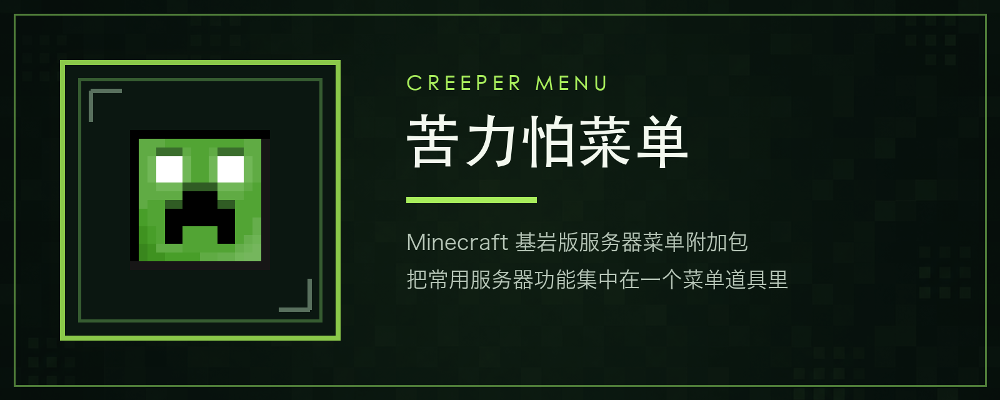

# 苦力怕菜单

Minecraft 基岩版服务器菜单附加包。它把传送、领地、经济、公会、路点和管理工具集中到一个菜单道具里。本仓库还包含已经独立拆包的 Backrooms Level 0 附加包。

> [!IMPORTANT]
> 本仓库公开源代码，但限制商业用途，属于 **source-available（源码可用）** 项目，而不是 OSI 定义的开源软件。代码许可为 [PolyForm Noncommercial License 1.0.0](LICENSE)，第三方素材适用各自条款。

> [!NOTE]
> 这是非官方 Minecraft 项目，不受 Mojang Studios 或 Microsoft 批准、认可、赞助或关联。

## 功能

- 菜单入口：使用 `yuehua:sm` 道具打开主菜单。
- 玩家功能：TPA、坐标与随机传送、个人/公共路点、在线时长与设置。
- 服务器系统：领地、经济、官方商店、玩家交易市场、红包、公会、PVP、任务和统计。
- 管理工具：玩家与背包管理、行为日志、防刷物品、公告、浮空字和调度面板。
- 自定义维度：苦力怕菜单提供 5 个通用虚空维度。
- 独立 Backrooms：按玩家隔离、按需延伸的 Level 0，以及独立实体、声景和资源包。

完整功能和管理员操作说明见 [项目知识库](docs/creeper-menu-knowledge-base.md)，版本变化见 [更新日志](CHANGELOG.md)。Backrooms 的生成、隔离和声景设计见 [Backrooms 无限生成器设计](docs/backrooms-generator.md)。

## 构建与附加包


| 产物                | 适用环境             | 特点                                            | 打包命令                        |
| ----------------- | ---------------- | --------------------------------------------- | --------------------------- |
| 苦力怕菜单普通兼容版        | 本地世界、普通基岩版环境、BDS | 保留旧版实体假人和新版模拟玩家，不依赖 BDS 专属模块                  | `npm run mcaddon`           |
| 苦力怕菜单 Realms 兼容版  | Minecraft Realms | 不声明或加载 `@minecraft/server-gametest`，仅支持旧版实体假人 | `npm run mcaddon:realms`    |
| 苦力怕菜单 BDS 增强版     | 仅 BDS 专用服务器      | 增加进服前黑名单拦截、XUID 解析和服务器网络能力                    | `npm run mcaddon:bds`       |
| Backrooms Level 0 | 本地世界、Realms、BDS  | 独立行为包与资源包，不依赖苦力怕菜单                            | `npm run mcaddon:backrooms` |


同时生成三个 CreeperMenu 发行产物：`npm run mcaddon:release`。当前版本的
Release 附件名称为：

- `CreeperMenu-v3.2.13-MCBE-1.26.3x-普通兼容版.mcaddon`
- `CreeperMenu-v3.2.13-MCBE-1.26.3x-Realms兼容版.mcaddon`
- `CreeperMenu-v3.2.13-MCBE-1.26.3x-BDS增强版.mcaddon`

三个 CreeperMenu 变体统一使用 **3.2.13** 发行版本。构建依赖精确锁定
Minecraft Bedrock **1.26.30**，面向用户标记为 **1.26.3x**，表示适配
正常的 `1.26.30` 至 `1.26.39` 小版本族。manifest 最低引擎版本仍为
**1.26.0**。

Backrooms 行为包和资源包继续使用独立版本 **1.0.0**，不会进入
CreeperMenu 的三版本 Release。需要同时生成它时可使用
`npm run mcaddon:all`。

## 项目架构

仓库同时维护苦力怕菜单和独立 Backrooms 附加包。运行时代码、行为包、资源包与构建工具彼此分离，同一套苦力怕菜单业务代码通过不同入口和 manifest 生成普通版、Realms 版与 BDS 增强版。

### 核心目录

```text
mcbes-manage-script/
├── behavior_packs/
│   ├── CreeperMenu/          # 苦力怕菜单行为包与各版本 manifest
│   └── Backrooms/            # 独立 Backrooms 行为包
├── resource_packs/
│   ├── CreeperMenu/          # 菜单 UI、道具、音乐、角色和其他资源
│   └── Backrooms/            # Backrooms 材质、声音、实体与渲染资源
├── scripts/
│   ├── main.standard.ts      # 普通兼容版入口
│   ├── main.realms.ts        # Realms 兼容版入口
│   ├── main.bds.ts           # BDS 增强版入口
│   ├── events/               # 事件注册与处理器
│   ├── features/             # 领地、经济、公会、假人等业务模块
│   ├── ui/                   # 表单、Chest UI 和公共界面组件
│   ├── shared/               # 数据库、Hook、维度隔离和通用工具
│   └── addons/backrooms/     # Backrooms 生成、运行时与 Lifeform 逻辑
├── tools/                    # 构建验证、品牌图、纹理、音频和图标工具
├── tests/                    # 逻辑、构建约束和受保护资源测试
├── docs/                     # 知识库、设计说明与实现记录
├── design/                   # 品牌、图标和欢迎角色设计资料
├── assets/                   # 可复现素材处理所需的输入资源
├── just.config.ts            # 编译、打包与本地部署任务
└── .github/workflows/ci.yml  # GitHub Actions 持续集成
```

`dist/`、`out/`、`node_modules/` 和本地 `.env` 均为生成内容或本机配置，不进入版本控制。

### 代码分层


| 层级    | 位置                                                        | 职责                                     |
| ----- | --------------------------------------------------------- | -------------------------------------- |
| 构建入口  | `scripts/main.standard.ts`、`main.realms.ts`、`main.bds.ts` | 选择运行环境对应的事件入口和平台能力                     |
| 事件层   | `scripts/events/`                                         | 集中注册世界、玩家、物品及服务器事件                     |
| 功能层   | `scripts/features/`                                       | 实现领地、经济、公会、路点、假人、行为日志等业务               |
| 界面层   | `scripts/ui/`                                             | 组织表单、Chest UI、菜单导航和界面组件                |
| 基础层   | `scripts/shared/`                                         | 提供数据库、公共 Hook、维度隔离和通用工具                |
| 平台能力层 | `scripts/features/platform/sapi-capabilities/`            | 统一封装 BDS、调试版与 Realms 的 API 差异          |
| 独立附加包 | `scripts/addons/backrooms/`                               | 实现 Backrooms 布局生成、区域队列、异常、声景和 Lifeform |


主要调用关系如下：

```text
构建入口
  ├─ 事件注册 ──> 功能服务 ──> 数据模型与持久化
  ├─ UI 表单 ───> 功能服务
  └─ 平台能力边界 ──> BDS / Realms / 通用 SAPI

Backrooms 入口
  └─ 布局与连通性 ──> 生成队列 ──> 区域构建 ──> 异常、声景与 Lifeform
```

业务与 UI 模块不应直接散落 BDS 或 Realms 的动态模块判断。`sapi-capabilities` 负责统一暴露构建标志和可选平台能力，避免普通版或 Realms 版意外加载 BDS 专属模块。

### 构建变体

`just.config.ts` 使用不同入口、编译标志和 manifest 生成各版本：

```text
普通版  ──> main.standard.ts + manifest.standard.json
Realms  ──> main.realms.ts   + manifest.realms.json
BDS     ──> main.bds.ts      + manifest.bds.json
Backrooms ─> backrooms.main.ts + 独立 Backrooms 行为包和资源包
```

- 普通版保留 GameTest 模块，用于新版模拟玩家，同时不启用 BDS 专属网络和管理 API。
- Realms 版在打包阶段替换模拟玩家运行时，并从 manifest 和最终 JavaScript 中移除 `@minecraft/server-gametest`。
- BDS 增强版启用 `@minecraft/server-net`、`@minecraft/server-admin` 等专用能力。
- Backrooms 使用独立入口、manifest、行为包和资源包，不依赖苦力怕菜单运行。
- `npm run mcaddon:all` 会依次生成四个 `.mcaddon`，最后把源码目录恢复到普通版 manifest。


### 持续集成（CI）

每次 push 和 Pull Request 都会触发 [GitHub Actions](.github/workflows/ci.yml)，在 Ubuntu 环境中执行：

1. 安装 Node.js 22.13.1、Python 3.12、npm 依赖和固定版本的 Python 素材工具依赖。
2. 执行 `npm run check`，完成 ESLint、Prettier、TypeScript 类型检查和全部测试。
3. 构建普通兼容版、BDS 增强版与 Realms 兼容版。
4. 检查 Realms manifest 和最终 JavaScript 均不包含 `@minecraft/server-gametest`。
5. 单独构建 Backrooms，确认它可以脱离苦力怕菜单完成编译。

测试除业务逻辑外，还会检查跨平台路径大小写、manifest 约束、资源尺寸、素材可复现性，以及经维护者确认的 DOVA 音乐、欢迎角色和假人皮肤是否被意外修改。

普通 push 和 Pull Request 会构建并上传普通兼容版、Realms 兼容版和 BDS
增强版三个短期 Actions artifacts，便于维护者下载验证，但不会创建 Release。
推送与统一发行版本匹配的 `v*` Tag 后，CI 会再次完成全部检查，自动创建
GitHub Release，并上传三个中文命名的 `.mcaddon`。CI 不代替真实
Minecraft、Realms 或 BDS 游戏内测试。

### 正式发布

`release.config.json` 是 CreeperMenu 的统一发行版本与 Minecraft 构建基线。
发布新版本时：

```bash
npm run release:sync -- 3.2.14
npm run check
git add release.config.json package.json package-lock.json behavior_packs/CreeperMenu resource_packs/CreeperMenu
git commit -m "chore: 发布苦力怕菜单 3.2.14"
git tag v3.2.14
git push origin HEAD
git push origin v3.2.14
```

Tag 必须严格等于 `v` 加统一发行版本，否则 CI 会拒绝发布。失败的 Tag 发布
可以在 GitHub Actions 页面手动重跑，并输入已经存在的同一 Tag；手动流程
不能发布任意分支或未经版本检查的 commit。

## 安装


### 苦力怕菜单

1. 从 Release 下载与目标环境对应的普通兼容版、Realms 兼容版或 BDS 增强版。
2. 本地世界使用 Minecraft 打开 `.mcaddon` 完成导入；BDS 可解压后部署行为包和资源包。
3. 在世界中同时启用 `苦力怕菜单_BP` 与 `苦力怕菜单_RP`。
4. 给管理员添加标签：

```mcfunction
/tag @s add admin
```

1. 获取菜单道具：

```mcfunction
/give @s yuehua:sm
```

手动安装时，将以下目录分别放入目标世界或服务器对应的行为包、资源包目录：

- `behavior_packs/CreeperMenu`
- `resource_packs/CreeperMenu`

BDS 增强版必须通过 `npm run build:bds-admin` 或 `npm run mcaddon:bds` 生成；Realms 兼容版必须通过 `npm run build:realms` 或 `npm run mcaddon:realms` 生成。不要直接把源码目录当作已经切换好 manifest 和脚本能力的发行版本。

> [!WARNING]
> Realms 兼容版仅支持旧版实体假人。世界中已有的新版模拟玩家记录会在首次加载时自动降级，并保留名称、创建者、位置、方向、皮肤和通用权限；新版专属的背包快照、死亡状态、自动行为和动作脚本会被清除，之后切回普通版或 BDS 版也不会自动恢复。切换版本前请备份世界。


### 后室

Backrooms 已从苦力怕菜单拆分为独立附加包。启用以下两个配套目录并完整重启：

- `behavior_packs/Backrooms`
- `resource_packs/Backrooms`

管理员或命令方块可使用：

```mcfunction
/yuehua:backrooms_tp @p
/yuehua:backrooms_tp @p 0 100 0
/yuehua:backrooms_exit @p
```

省略坐标时，每个玩家会进入相距极远且持久稳定的独立 manifestation；显式坐标会先生成目标区域并收敛到安全落脚点。同时安装苦力怕菜单时，聊天、TPA 与坐标点系统会遵守 Backrooms 发布的维度隔离策略。

## 开发与构建

环境要求：

- Node.js `20.19+`、`22.13+` 或 `24+`
- npm
- Python 3.11+（仅用于素材可复现性测试）

安装与检查：

```bash
npm ci
python3 -m pip install -r requirements-dev.txt
cp .env.example .env
npm run check
```

常用命令：

```bash
npm run lint              # ESLint
npm run typecheck         # TypeScript 类型检查
npm test                  # 发布约束与资源保护测试
npm run build:standard    # 构建菜单普通版和独立 Backrooms
npm run build:realms      # 构建 Realms 菜单版和独立 Backrooms
npm run build:bds-admin   # 构建菜单 BDS 版和独立 Backrooms
npm run build:backrooms   # 仅构建 Backrooms 脚本
npm run mcaddon           # 打包菜单普通兼容版
npm run mcaddon:realms    # 打包菜单 Realms 兼容版
npm run mcaddon:bds       # 打包菜单 BDS 增强版
npm run mcaddon:backrooms # 打包独立 Backrooms
npm run mcaddon:all       # 打包全部产物
npm run mcaddon:release   # 打包三个 CreeperMenu Release 产物
npm run release:check     # 检查统一版本与全部 manifest
npm run release:sync -- 3.2.14 # 同步下一发行版本
npm run verify:realms-build # 检查当前 Realms manifest 和脚本不含不支持模块
```

本地部署需要在 `.env` 中设置 `PROJECT_NAME`；使用 BDS 部署任务时还需设置 `BDS_SERVER_DEPLOY_PATH`。普通构建和代码检查不要求部署路径。

`package.json` 中仍保留 `@minecraft/server-gametest` 源码依赖，因为普通兼容版和 BDS 增强版需要编译新版模拟玩家。Realms 构建会在打包期替换该运行时边界，最终 manifest 和 JavaScript 产物均不包含该模块。

### 更新 Chest UI 原版物品图标映射

官方商店、玩家交易市场等界面使用 `textures/...` 路径显示物品图标。映射文件为 `scripts/features/system/services/vanilla-item-icon-paths.ts`，生成器为 `tools/build-vanilla-icon-map.ts`：

```bash
npm run build:vanilla-icon-map
npm run build:vanilla-icon-map -- 1.26.30
```

生成器会从 Mojang 官方 `bedrock-samples` 获取物品和贴图元数据，诊断报告输出到 `out/vanilla-icon-map/`。

### 品牌图

包图标与本页横幅由 [品牌构建脚本](tools/build-brand-assets.py) 生成。中央始终使用现有菜单道具 `sm.png`，脚本只读取它，不会覆盖或重绘游戏内纹理。背景来自项目内保留的 ImageGen 源图。

## 贡献

欢迎提交问题和非商业用途的改进。提交 PR 前请运行：

```bash
npm run check
npm run build:standard
npm run build:realms
npm run verify:realms-build
npm run build:bds-admin
npm run build:backrooms
```


## 许可与第三方内容

项目原创代码和未单独标注的原创内容使用 [PolyForm Noncommercial License 1.0.0](LICENSE)：允许非商业使用、研究、修改和再分发，但不允许商业用途。

Minecraft 名称与素材、DOVA-SYNDROME 音乐、Pixabay 音效及二次元角色资源不由项目许可证重新授权。来源、署名和适用边界见 [第三方素材与商标声明](THIRD_PARTY_NOTICES.md)。
