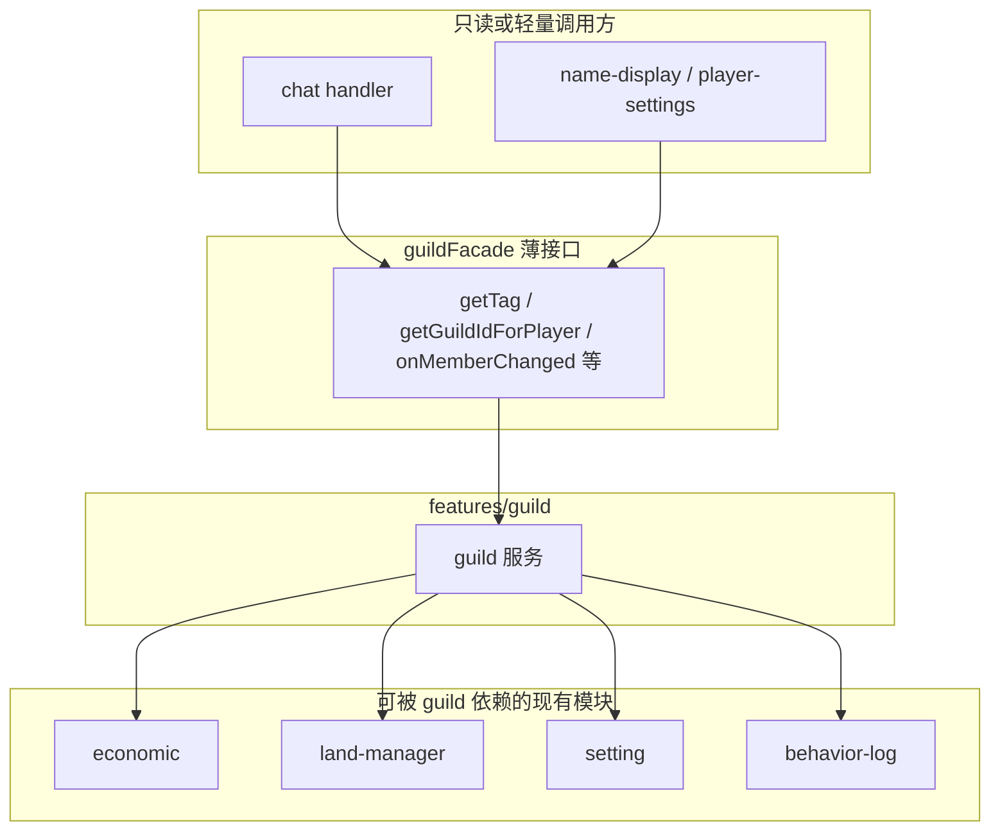

# 公会系统设计说明（与现有模块的协作关系）

本文档面向 **杜绝熊孩服务器插件（mcbes-manage-script）** 当前代码结构，说明如何实现一个**与现有系统深度联动**的公会系统，而不是单独挂在一旁的「孤岛功能」。后续实现时可按阶段拆分任务。

## 目录

- [1. 为什么公会不应做成独立系统](#1-为什么公会不应做成独立系统)
- [2. 当前项目结构（与公会相关的部分）](#2-当前项目结构与公会相关的部分)
- [3. 公会核心数据模型（建议）](#3-公会核心数据模型建议)
- [4. 与各现有模块的协作方式](#4-与各现有模块的协作方式)
- [5. 推荐实现阶段](#5-推荐实现阶段降低一次性复杂度)
- [6. 小结](#6-小结)
- [7. 边界情况与数据一致性](#7-边界情况与数据一致性建议尽早写进设计)
- [8. BDS / 脚本 API 下的性能与约束](#8-bds--脚本-api-下的性能与约束)
- [9. 对外 API 契约（Facade）](#9-对外-api-契约facade)
- [10. 数据版本与迁移](#10-数据版本与迁移)

下面四节（7～10）不是「和公会无关的计算机课」，而是 **做公会功能时一定会踩到的坑** 的提前说明：第 7 节是「公会数据别写坏」、第 8 节是「公会聊天/头顶字别拖垮服务器」、第 9 节是「聊天和名字显示怎么安全地读到公会信息」、第 10 节是「以后给公会加新字段时旧存档怎么办」。

---

## 1. 为什么公会不应做成独立系统

在常见网游里，公会的价值来自：

- **资源与权限**：资金、领地、战利品、商店税等；
- **社交与展示**：聊天频道、名称前缀、公告；
- **治理与风控**：会长/副会长、踢人、与封禁/试玩联动。

你项目里已经具备 **经济、领地、命令、设置、行为日志、通知、名称显示、黑名单/试玩** 等模块。若公会只维护自己的一张表、一套 UI，玩家会感知为「多填了一个表单」，**粘性弱**；若公会能驱动或约束这些模块，才符合「常见游戏」的体验。

---

## 2. 当前项目结构（与公会相关的部分）

| 层级 | 路径/职责 | 与公会的典型关系 |
|------|-----------|------------------|
| 持久化 | `scripts/shared/database/database.ts` — `Database<T>`，世界动态属性 + 分块存储 | 公会数据与 `lands`、`eco_wallets` 同级，新建如 `guilds` 库 |
| 全局类型 | `scripts/core/types.ts` | 可扩展 `IGuild`、`IGuildMember`，或放在 `features/guild/models/` |
| 功能域 | `scripts/features/*` — economic、land、command、system、blacklist、notify、behavior-log、pvp、waypoint、player 等 | 公会服务**调用**这些模块的公开 API，而不是复制逻辑 |
| 事件 | `scripts/Events/registry.ts` + `scripts/Events/handlers/*`（`main.ts` 中为小写路径 `./events/...`，与磁盘目录在 Windows 上通常等价） | 聊天、玩家进出、领地进出等事件里**挂载**公会逻辑（前缀、频道、日志） |
| 命令 | `scripts/features/command/services/command.ts` | 增加 `yuehua:guild` 或子命令，风格与现有 `yuehua:land`、`yuehua:money` 一致 |
| UI | `scripts/ui/forms/*` | 公会管理、银行、邀请等表单，与 `economic`、`land` 表单并列导出 |

**依赖方向建议（避免循环引用）：**

- `guild` 服务 → 可依赖：`economic`、`land`（只读或受控写）、`setting`、`use-notify`、行为日志封装等。
- `chat` / `name-display` → 若只需「读公会信息」，应通过 **薄接口**（见下文 [§9](#9-对外-api-契约facade)），避免 `guild` 再反向 import 聊天模块。

**模块依赖示意（数据流自上而下）：**

---

## 3. 公会核心数据模型（建议）

以下为逻辑模型，实际字段可按性能与迁移成本微调。

### 3.1 公会 `IGuild`

- **标识**：`id`（稳定主键）、`name`（展示名）、`tag`（短标签，用于聊天/头顶）。
- **成员**：`owner`、`members: Record<playerName, role>` 或 `members[]` + `role`。
- **经济**：`treasuryGold`（公会金库，与玩家钱包分离）、可选 `taxRate`、`lastPayrollAt`。
- **元数据**：`createdAt`、`level`（若做升级）、`announcement`。
- **可选**：`homeWaypointId`（关联公会共享路点）、`alliedGuildIds`（若做外交）。
- **建议**：`schemaVersion`（整数），便于 [§10](#10-数据版本与迁移) 做字段升级。

### 3.2 玩家侧索引（二选一或并存）

- 在玩家维度存 `guildId`（或 `playerName → guildId` 映射表），便于 **O(1)** 查「某玩家是否在某公会」。
- 与现有经济一致：经济用 **玩家名为键**（`eco_wallets`），公会侧建议也以 **当前游戏内名字符串** 为主键之一，并注意 **改名** 时同步（可与 `name-display` / `player-settings` 策略对齐）。

### 3.3 邀请与待处理状态（MVP 可简化）

若做邀请制，建议单独结构（或内嵌字段）表达 **pendingInvites**（目标玩家、过期时间、邀请者），避免只靠聊天口头约定导致状态不一致。

---

## 4. 与各现有模块的协作方式

### 4.1 经济系统（`features/economic`）

| 场景 | 做法 |
|------|------|
| 公会金库 | 使用独立字段 `treasuryGold` + `Database` 持久化；**转入/转出**时调用 `economic` 的转账或增减 API（若已有 `addGold`/`transfer` 类方法），并写入 `reason` 为 `guild:xxx`，便于审计。 |
| 创建/升级公会 | 从玩家钱包扣除 **创建费**（配置项走 `setting`）。 |
| 公会商店/分红 | 若后续有「公会内拍」或「抽税」，可与 `auction-house`、`office-shop` 在 **单笔交易** 上挂钩（抽成入金库）。 |

**原则**：金币的「真相来源」仍是经济服务；公会只多一层 **聚合账户** 与权限校验。

### 4.2 领地系统（`features/land`）

| 场景 | 做法 |
|------|------|
| 与公会协作 | 领主可在领地侧将本领地与公会同步（成员、绑定标记等），**破坏/放置权限**仍走现有领地判定；不作为单独的「公会领地」类型规划。 |
| 费用 | 扩领地扣费时，可检查是否 **公会赞助**（从金库扣而非个人）。 |

### 4.3 系统设置（`features/system/services/setting.ts`）

在 `IModules` / `defaultSetting` 中增加例如：

- `guild`（总开关）、`guildCreateCost`、`guildMaxMembers` 等。

其它模块通过 `setting.getState(...)` 判断是否启用公会相关逻辑（与 `economy`、`land`、`behaviorLogEnabled` 同一模式）。

### 4.4 命令系统（`features/command/services/command.ts`）

与现有自定义命令一致，例如：

- `/yuehua:guild create | invite | accept | leave | kick | promote | info | bank | ...`

命令处理函数内调用 **公会服务单例**，由服务再去调经济/领地；保持 **命令层薄、服务层厚**。**所有权限判断（谁能踢人、谁能动金库）必须在服务端服务层完成**，命令入口只做参数解析与玩家上下文传递。

### 4.5 聊天与名称展示（`Events/handlers/chat.ts`、`name-display`、`player-settings`）

| 场景 | 做法 |
|------|------|
| 前缀 | 聊天消息前拼接 `[公会标签]`，数据来自公会服务查询。 |
| 公会频道 | 若实现仅成员可见的频道，在 `chat` 事件里 `cancel` 原广播，改 `world.getPlayers()` 过滤 `同公会` 后发送（注意性能与刷屏）。 |
| 名称标签 | 在 `NameDisplay` / `PlayerSetting.getPlayerDisplayName` 的拼接规则中增加「公会简称」（可开关，避免过长）。 |

### 4.6 黑名单与试玩（`blacklist`、`trial-mode`）

| 场景 | 做法 |
|------|------|
| 被封禁 | 可在封禁流程中 **自动移出公会** 或 **冻结会长转让**（策略可配置）。 |
| 试玩玩家 | 可限制 **创建公会**、**使用金库**，与经济/领地的试玩限制一致。 |

### 4.7 行为日志（`features/behavior-log`）

扩展 `BehaviorEventType`（或等价扩展点），例如：

- `guildCreate`、`guildJoin`、`guildLeave`、`guildKick`、`guildTreasuryDeposit`、`guildTreasuryWithdraw`

便于管理端与事后追责，与现有 `enterLand`、`pvpHit` 等并列查询。

### 4.8 全服通知（`features/notify`）

- 重大事件（如公会创建）可调用现有 **广播消息** 能力；与定时公告并存，注意频率与 `setting` 开关。

### 4.9 PVP（`features/pvp`）

- **当前实现不与 PVP 模块挂钩**（无同公会友伤、无公会战等）；若日后需要再单独设计，避免与现有战斗标签/保护规则冲突。

### 4.10 路点（`features/waypoint`）

- 可选：**公会共享路点**（读多写少，权限由会长/副会长控制），复用 `waypoint` 数据结构，增加 `guildId` 或独立列表。

### 4.11 UI / 箱子界面（`scripts/ui/...`）

- 公会管理、金库存取、成员列表等：**Modal / Server Form** 与 `economic`、`land` 表单同一套模式即可。
- 若存在「共享仓库」类需求，可与 `chest-ui` 类似思路，但需注意 BDS 性能与权限校验放在服务端。

---

## 5. 推荐实现阶段（降低一次性复杂度）

1. **MVP**：数据模型 + `Database` + 创建/解散/加入/离开 + 命令 + 基础查询；**设置项**开关。
2. **展示与社交**：聊天前缀 + 名称标签（可关）；**行为日志**事件。
3. **经济**：金库、会费、简单转账到金库；与 **试玩/黑名单** 规则对齐。
4. **领地联动**：领主侧与公会同步（见 4.2）；**公会共享路点**（见 4.10）可与此阶段并行或稍后。
5. **扩展**：拍卖抽成等（不与 PVP 混在同一期时也可并行迭代）。

---

## 6. 小结

- 公会在你项目里应定位为 **跨模块的「玩家组织层」**：钱走经济、地走领地、话走聊天、名走显示、事走行为日志、开关走设置。
- 技术上沿用 **`Database<T>` + `features/guild` 服务 + 命令 + 事件钩子** 即可与现有架构一致，后续迭代只需加配置与挂钩点，而不必推翻重来。

---

## 7. 边界情况与数据一致性（建议尽早写进设计）

**和公会的关系：** 公会里要存「谁在哪个会」「会长是谁」「钱进金库」——这些操作一多，就会出现 **改名了还占着旧名额、解散了一半、邀请乱了、扣钱只扣了一半** 等问题；这一节列的就是 **公会业务自己** 会遇到的异常，不是泛泛的数据库理论。

| 问题 | 建议策略 |
|------|----------|
| **玩家改名** | 成员列表、`playerName → guildId` 若存名字，需在可观测的改名路径上 **原子更新**（或统一用 `xuid` 作主成员键，名字作展示字段——若脚本层能稳定取到 xuid）。与经济钱包键策略保持一致，避免出现「旧名仍在公会、新名查不到」的双记录。 |
| **会长离线时解散/转让** | 明确规则：仅在线可执行，或支持 **副会长继任**；避免半状态（会长已删、公会无主）。 |
| **标签 / 展示名唯一性** | 创建时查重；冲突时拒绝或自动加后缀。 |
| **并发邀请** | 同一玩家同时收到多个公会邀请时，**接受其一**后应清理其它 pending 状态。 |
| **解散公会** | 一次性：`members` 清空、`playerName → guildId` 批量删、可选通知领地模块解除 `guildId` 关联；失败时需可重试或日志告警。 |
| **金库与钱包双写** | 玩家扣款 + 金库加款应在同一逻辑路径内顺序执行；若中途失败，需有 **补偿或回滚**（至少打错误日志并避免只成功一半）。 |

---

## 8. BDS / 脚本 API 下的性能与约束

**和公会的关系：** 文档前面写了要在 **聊天** 里加公会前缀、在 **头顶名字** 上显示简称、可能还有 **公会频道**——这些都会在脚本里 **高频执行**。若每说一句话就全服查一遍公会库，人多了会卡服；这一节约束的是 **公会相关展示/广播** 的实现方式，不是别的模块。

- **每 tick 工作量**：聊天、名称刷新若对 **全员** 做重查询，高在线时容易放大开销。Facade 层可做 **短 TTL 内存缓存**（如当前在线玩家名 → 公会标签，玩家离开或公会变更时 invalidate）。
- **`world.getPlayers()`**：公会频道广播会频繁遍历；可限制频道功能为「可选」或合并消息发送频率。
- **字符串与消息长度**：聊天前缀 + 正文注意总长度，避免被截断或刷屏；`nameTag` 过长影响可读性，建议 `setting` 限制标签字数。
- **动态属性上限**：`Database` 已有分块逻辑；公会成员极多时要监控 **单库 JSON 体积**，必要时拆键（例如按 `guildId` 分条存储成员子文档）。

---

## 9. 对外 API 契约（Facade）

**和公会的关系：** 聊天和名字显示需要显示 `[公会标签]`，但它们 **不应该** 直接打开公会的 `Database` 或改成员表——否则会和公会模块 **互相 import、改一处崩一片**。Facade 就是 **只给外面用的几个读接口**（例如「这个名字当前公会标签是什么」），专门解决 **公会 ↔ 聊天/显示** 怎么连上的问题。

供 `chat`、`name-display` 等模块使用的 **只读或窄接口** 建议固定为少量函数，避免它们依赖 `guild` 内部结构：

- `isGuildModuleEnabled(): boolean`（内部读 `setting`）
- `getDisplayTagForPlayerName(name: string): string | undefined`
- `getGuildIdForPlayerName(name: string): string | undefined`
- 可选：`subscribeGuildMembershipChanged(callback)` 或在公会服务内 **主动调用** `NameDisplay.forceUpdatePlayerNameDisplay`，减少定时全表扫描。

**禁止**：在展示层直接读 `Database` 或改公会原始对象。

---

## 10. 数据版本与迁移

**和公会的关系：** 公会的存档（`guilds` 库里的 JSON）会 **长期存在**。以后你若增加「副会长」「公会等级」「金库每日限额」等字段，旧世界的存档里还没有这些键——这一节说的是 **公会自己的存档** 如何升级，避免一改代码老服公会数据全废。

- 在 `IGuild`（或库根对象）中保留 **`schemaVersion`**。
- 读库时若版本低于当前代码，在 **首次访问** 时执行迁移（补默认字段、重算索引），再写回并升版本。
- 与 `behavior-log` 等模块类似，新增事件类型时考虑 **旧查询 UI** 是否需兼容「无此类事件」的空结果。

---

*文档版本：2026-03 初版；2026-03 增补目录、边界、BDS 约束、Facade、迁移与依赖示意图。实现时请以当时 `main.ts` 与各 `features` 入口为准做微调。*
