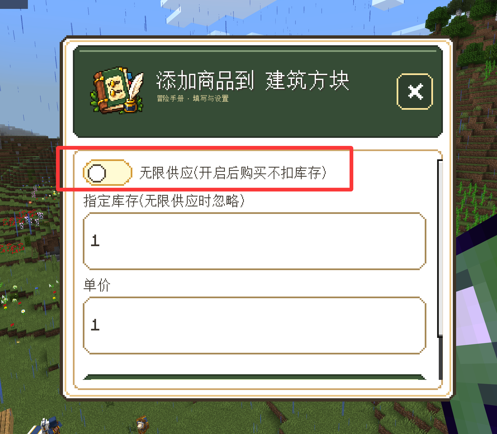

# 官方商店无限供应

在官方商店管理中，添加商品或编辑现有商品时，开启“无限供应（开启后购买不扣库存）”，然后提交保存。开启后“指定库存”输入框会被忽略，商品显示为“无限供应”，购买不会扣减库存。

下图是添加商品表单，红框标出了开关位置；编辑商品表单也提供同样的开关。截图用于定位，实际使用时请将开关开启并保存。

需要恢复限量销售时，关闭开关，填写正整数库存并保存。该功能对应 [issue #33](https://github.com/YueHua46/mcbes-manage-script/issues/33)。
